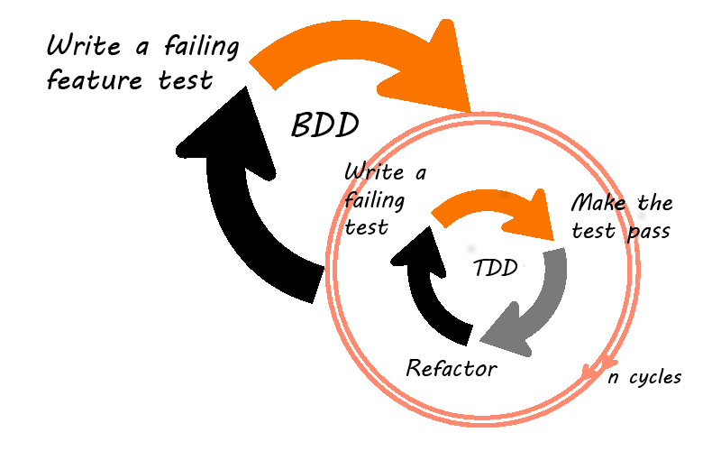

The first thing you hear about TDD/BDD is this:

1. Write a failing acceptance/feature test.
2. Write a failing unit test.
3. Make the unit test pass.
4. Refactor your code.
5. Repeat step 2,3,4 until acceptance/feature test pass.

When I saw this I said, "Oh TDD is so easy", but once I started writing the acceptance test I had no idea where to start, maybe it's easier if you work on a backend API, just calling the endpoint and expecting a certain response.

So how to do it in a web application? what is our top-level API? The browser (HTML, CSS, javascript all together) is what we are building, a user interacts with our application by clicking, typing, navigating, etc. so we must write our acceptance test interacting directly with the browser and test for the expected behavior to happen.

All this sounds familiar, have you heard about selenium? E2E tests? It's the same but with server stubbing and without the old selenium API.

## How to write E2E tests without a backend API

We need:

* A test environment to run the tests and allow us to stub the requests
* A server stubbing library to handle the requests
* **Recommended** A page objects library

### Setting up jest with puppeteer

I use **puppeteer** as a headless browser, it's developed by chromium team and offers a complete API over chromium. We are using it because allows us to intercept any request made.

For the test environment, I  choose  **jest**, It has many benefits, seamless configuration and async test in particular. To configure puppeteer, we need to setup a few configuration files:

**globalSetup**
```javascript
const DIR = path.join(os.tmpdir(), 'jest_puppeteer_global_setup');

module.exports = async function() {
  // If is debug get up headed model
  const puppeteerConfig = {
    headless: true,
  };
  if (process.env.DEBUG) {
    puppeteerConfig.headless = false;
    puppeteerConfig.slowMo = 100;
  }

  const browser = await puppeteer.launch(puppeteerConfig);
  global.__BROWSER__ = browser;
  mkdirp.sync(DIR);
  fs.writeFileSync(path.join(DIR, 'wsEndpoint'), browser.wsEndpoint());
};
```

We start our browser and store web socket endpoint in a temp file. You may have noticed the async function, this new configuration accepts an async function and waits until a promise resolves.

**globalTeardown**
```javascript
module.exports = async function() {
  if (!process.env.DEBUG) {
    await global.__BROWSER__.close();
  }
  rimraf.sync(DIR);
};
```

We close our browser, sometimes I don't want to close the browser when I'm debugging.

**testEnvironment**
```javascript
class PuppeteerEnvironment extends NodeEnvironment {
  async setup() {
    await super.setup();
    const wsEndpoint = fs.readFileSync(wsEndpointDir, 'utf8');
    if (!wsEndpoint) throw new Error('wsEndpoint not found');
    this.global.browser = await puppeteer.connect({
      browserWSEndpoint: wsEndpoint,
    });
    this.global.debug = process.env.DEBUG;
    this.global.host = process.env.HOST;
  }
}
module.exports = PuppeteerEnvironment;
```

Finally, I connect with the browser I already created and setup some variables to be used in all my tests.

### Server stubbing

This is the most crucial part, stubbing the server is what sets the difference between **acceptance** and **e2e** tests, I was not looking for some fancy library, I wrote mine, you can see it [here](https://github.com/marduke182/baird/tree/master/packages/baird-server), you can register contracts and the library will intercept all requests from puppeteer.


*user.test.js*
```javascript
beforeAll(async () => {
  global.page = await global.browser.newPage();
  global.server = new BairdServer({ baseUrl: global.host });

  await BairdServer.intercept(global.page, global.server);
});

test('should create an account', async () => {
  // Prepare server with a create contract
  global.server.with(
    contracts.api.v2.user.post.createJohnDoe,
  );
...
});
```

This little example shows how you can use it. First of all, you need to create a new instance of the server and intercept requests from the given page, after this, each request in this page will be handled by the server.

Now you only have to design your API and create a contract, stub the server and write your unit test and real code. This separation from the backend gives you the freedom to develop new features without caring about the backend implementation, storing or removing users from DB, etc.

### Page object

Puppeteer API is amazing, however it wasn't made as an assert library, lucky me, It's very easy to implement each assert you may want to use. For this, I made a set of wrappers for each element, input, button, select, etc. This pattern is called *page object*, it's well known, and helps you write cleaner tests by encapsulating information about the elements on your application page.

**Puppeteer utils**
```javascript
const exist = (page, selector) => page.$(selector).then(elem => elem !== null);
const type = async (page, selector, value) => await page.type(selector, value);
...

const input = (page, selector)  => {
  return {
    exist: () => exist(page, selector,),
    typw: (value) => type(page, selector, value),
  };
};
```
Everything starts with a set of [utils](https://github.com/marduke182/baird/tree/master/packages/baird-page-objects), after that we create the page

```javascript
const createRegisterPage =  (page, host) => {

  return {
    inputs: { email: input(page, emailSelector), ... },
    async go() {
      await page.goto(urls.register(host));
    },
    async createAccount(email, password) {
      await inputs.email.type(email);
      await inputs.password.type(password);

      await buttons.createAccount.click();

      await page.waitForNavigation();
    },
  };
};
})
```

### All together


```javascript
beforeAll(async () => {
  global.page = await global.browser.newPage();
  global.server = new BairdServer({ baseUrl: global.host });

  await BairdServer.intercept(global.page, global.server);
});

let registerPage;
beforeEach(async () => {
  registerPage = createRegisterPage(global.page, global.host);
  await registerPage.go();
});

test('should create an account', async () => {
  // Prepare server with a create contract
  global.server.with(
    contracts.api.v2.user.post.createJohnDoe,
  );
  
  const username = 'john@doe.com';
  const password = '123456';

  // Try to create an account
  await registerPage.createAccount(username, password);

  // Expect server to receive a request with right data
  const request = { path: '/user', method: 'POST', body: { username, password }};
  expect(global.server).serverToBeCalledWith(request);
});

afterAll(async () => {
  if (!global.debug) {
    await page.close();
  }
});
```

## Conclusion
* This approach helps you replicate any complicated state of your application, without interacting with external services.
* You can run these tests in production without affecting your database, statistics, etc.
* Faster and more reliable than normal E2E tests.
* Helps you in implementing a proper TDD working process.
* Not all is perfect, the Achilles heel here are the contracts, if you integrate this solution with a contract testing library like Pact, you can assure a high-quality frontend product.

## Resources

 [https://github.com/marduke182/e2e-boilerplate](https://github.com/marduke182/e2e-boilerplate)

 [https://github.com/marduke182/baird](https://github.com/marduke182/baird)