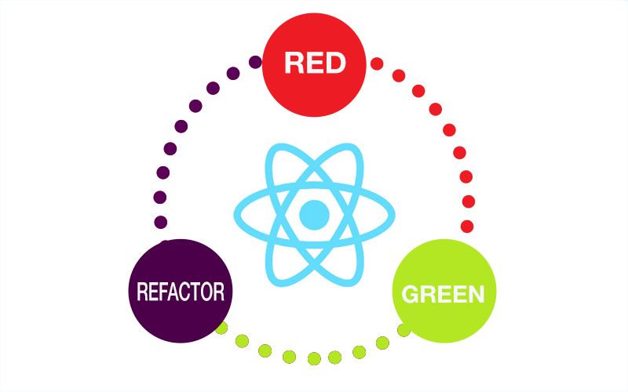

Starting with test is not easy, but if you are trying to do TDD while improving your code quality and/or speed it's a must. Having a test discipline doesn't make you a faster developer but it helps a lot in maintaining the code and empowers you with the confidence to perform refactors and implement new features very fast.

Writing tests in new technologies has its challenges, however, there are a lot of best practices to make it easy to do on react, let me explain it.

## Jest is your best friend

If you have worked on javascript before, you may have notice **jest** is the top library, and it will probably stay that way for a few years. The time of karma, jasmine, chai, mocha has passed, they are still good technologies but jest has made writing tests very easy.

I remember an interview where I spent over an hour trying to configure karma :(, in comparison when you install jest you are ready to go. Remember, you can rewrite your tests to any assert library, so don't care about the underlying technology

### Configuration

If you are using **create-react-app** you don't have to do any configuration, if you want to install some frameworks, you can do it at *src/setupFiles.js*.

If you are not using **create-react-app**, jest offers you a lot of options, my prefered is to use  *package.json*, by default jest will look for any files with the extension *.test.{js,jsx}* or *\_\_tests\_\_/\*.{js,jsx}*. You can check the documentation [here](https://jestjs.io/docs/en/configuration#testmatch-array-string).

## Use enzyme to improve developer experience

You can do tests **without Enzyme**, that's a fact, likewise, you can do a web application without React, Enzyme is for testing what React is for web development, a set of tools to improve your speed and developer experience.

For example, this is a test with test utils:

```jsx{numberLines: true}
test('should create account', async () => {
  const createAccount = ReactTestUtils.renderIntoDocument(
    <CreateAccount onCreate={onCreate} />,
  );

  const [emailNode] = ReactTestUtils.findAllInRenderedTree(
    createAccount,
    el => el.name === 'email',
  );
  const [passwordNode] = ReactTestUtils.findAllInRenderedTree(
    createAccount,
    el => el.name === 'password',
  );
  const [buttonNode] = ReactTestUtils.findAllInRenderedTree(
    createAccount,
    el => el.type === 'submit',
  );

  emailNode.value = johnDoeEmail;
  ReactTestUtils.Simulate.change(emailNode);

  passwordNode.value = oneToThreePassword;
  ReactTestUtils.Simulate.change(emailNode);

  ReactTestUtils.Simulate.click(buttonNode);

  expect(onCreate).toHaveBeenCalledWith({
    email: johnDoeEmail,
    password: oneToThreePassword,
  });
});
```

And can be rewritten to this using enzyme:

```jsx
test('should create an account with enzyme', async () => {
  const createAccount = shallow(<CreateAccount onCreate={onCreate} />);

  const email = createAccount.find('input[name="email"]');
  const password = createAccount.find('input[name="password"]');

  email.instance().value = johnDoeEmail;
  email.simulate('change', email);

  password.instance().value = oneToThreePassword;
  password.simulate('change', password);

  createAccount.find('button').simulate('click');

  expect(onCreate).toHaveBeenCalledWith({
    email: johnDoeEmail,
    password: oneToThreePassword,
  });
});

```
You can see how the second test is more readable and focused on what you are asserting. You have a set of utils to assert, manipulate and traverse your React components. 

> Tip: Try to write your tests in the most readable way possible. If you can't understand what is being tested, you need to rewrite your test.

To configure enzyme check his [homepage](https://github.com/airbnb/enzyme), also check [enzyme-matchers](https://github.com/FormidableLabs/enzyme-matchers) to have a set of helpers to do assertions to enzyme wrappers.

## Use shallow rendering

If you look at the last example, you will realize I'm using **shallow(...)**, this helps us in testing the component as a unit and prevents your tests from being affected by its child components' behavior.

> Tip: Always test **a unit** of the component, everything else that is not related to the assertion must be mocked, stubbed, etc.

There are few exceptions, for example:

* Testing a component that is connected to a redux store
* A component wrapped within a **High Order Component**
* Any integration tests.

So in conclusion, use shallow for **unit testing** and mount for **integration testing**.

## Writing your tests

>  TLDR; Start writing your assertion, continue with the acts and finally arrange your tests.

Let's start writing the test, the first part is easy to write, the name, keep in mind the name should express the thing you want to assert in a clear, concise way, for example:

```jsx
test('should create an account after adding email, password and clicking continue', () => {})
```

### Assert

Now that you know the purpose of the test, let's start writing the assertion.

```jsx
test('should create an account after adding email, password and clicking continue', () => {
      // 1. assert
    expect(onCreate)...
})
```

> Tip: Write only one assertion for the test, this will help you to know what is failing or asserting.

In React the assertion could be summarized in three things:

- Child component has been rendered.
- The function passed to the component was called.
- Child component has a property.

### Acts

So now what are the actions that make the assertion valid? This is called **acts**,

```jsx
test('should create an account after adding email, password and clicking continue', () => {
      // 2. acts
    email.simulate('change', ...);
    password.simulate('change', ...);
    button.simulate('click', ...);
    
    // 1. assert
    expect(onCreate)...
})
```

React behaviors are specific and can only trigger with a few actions,

- Setting a specific prop, eg.  "should show loading if loading prop is passed".
- Simulating an event from a user, like a click, change, blur, etc.
- Calling a function passed to the child component.

### Arrange

And finally, what does it mean email, password, and button? we need to **arrange** our test and prepare all the required components, functions, etc. beforehand 

```jsx
test('should create an account after adding email, password and clicking continue', () => {
    // 3. arrange
    const { email, password, button } = setup();
    
    // 2. acts
    email.simulate('change', ...);
    password.simulate('change', ...);
    button.simulate('click', ...);
    
    // 1. assert
    expect(onCreate)...
})
```

We can implement this in many ways, but the one that helps me more is using a **setup function**. The idea behind a setup function is to put all the common tasks in one place, like a.shallow rendering/mounting the components, b.finding components, etc. This makes the configuration  explicit and cleans up boilerplate from the actual tests.

Remember, the order is very important when you write your test (assert, act, arrange), it gives you perspective and focuses on what you are testing.

## Altogether

Let's rewrite our first example following this new concepts:

```jsx
function setup(props = {}) {
  const wrapper = shallow(<CreateAccount {...props} />);
    
  const createAccount = {
    wrapper,
    get email() { return wrapper.find('input[name="email"]')},
    get password() { return wrapper.find('input[name="password"]')},
    get button() { return wrapper.find('input[name="password"]')},
    
    typeEmail(value) {
      const email = createAccount.email;
      email.value = value;
      email.simulate('change', email)
        },
    typePassword(value) {
      const password = createAccount.password;
      password.value = value;
      password.simulate('change', password)
        }
    };
    return createAccount;
}

test('should create an account after add email, password and click continue', async () => {
  const onCreate = jest.fn();
  const createAccount = setup({ onCreate });

  createAccount.typeEmail(johnDoeEmail);
  createAccount.typePassword(oneToThreePassword);
  createAccount.button.simulate('click');

  expect(onCreate).toHaveBeenCalledWith({
    email: johnDoeEmail,
    password: oneToThreePassword,
  });
});
```

You can look at how the different parts work together to create the final test.

## Resources

[Enzyme](https://github.com/airbnb/enzyme)

[Enzyme Matchers](https://github.com/FormidableLabs/enzyme-matchers)

[Jest](https://jestjs.io/)